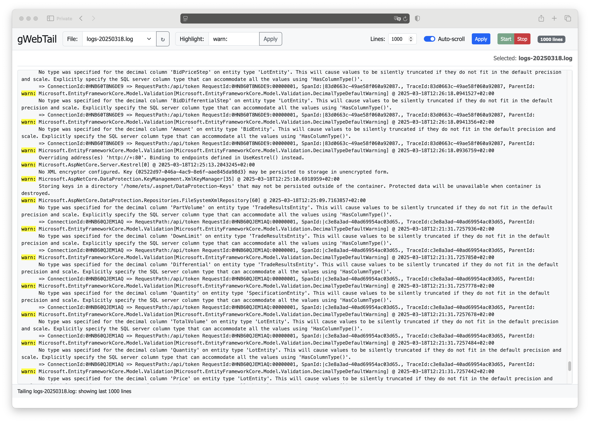

# gWebTail

A simple, lightweight web-based log file viewer with real-time log tailing via WebSockets.



## Features

- **Web-based log viewer** - Access your logs from any browser
- **Real-time updates** - See new log entries immediately as they're written
- **Syntax highlighting** - Highlight specific text patterns for easier reading
- **Adjustable display** - Configure how many lines to show
- **Full-width viewing** - Maximize screen space for log content
- **Start/Stop controls** - Pause updates when needed
- **Auto-scroll** - Automatically follow new log entries
- **Status indicators** - See connection status and view metrics

## Quick Start

### Using Docker

```bash
# Pull the image
docker pull docker.io/bsv9/gwebtail

# Run with default settings (logs in /logs directory)
docker run -p 8080:8080 -d docker.io/bsv9/gwebtail

# Run with custom log directory
docker run -p 8080:8080 -v /path/to/logs:/logs -d docker.io/bsv9/gwebtail

# Run with custom port
docker run -p 9000:8080 -d docker.io/bsv9/gwebtail

# Access WebTail
open http://localhost:8080
```

> **Note**: The Docker image supports multiple architectures including amd64, arm64, and armv7, allowing it to run on a variety of platforms including Raspberry Pi, AWS Graviton instances, and Apple Silicon devices.

### Manual Installation

```bash
# Clone the repository
git clone https://github.com/bsv9/gwebtail.git
cd gwebtail

# Build the application
go build -o gwebtail

# Run with default settings
./gwebtail

# Run with custom log directory
LOG_DIR=/path/to/logs ./gwebtail

# Run with custom port
./gwebtail -port 9000
```

## Configuration

WebTail can be configured through environment variables or command-line flags:

| Environment Variable | Flag       | Description                           | Default  |
|----------------------|------------|---------------------------------------|----------|
| `LOG_DIR`            | `-logdir`  | Directory containing log files        | `/logs`  |
| (none)               | `-port`    | HTTP server port                      | `8080`   |
| (none)               | `-maxlines`| Maximum number of lines to display    | `1000`   |

## Usage

1. **Select a log file** - Choose from the dropdown menu
2. **Start tailing** - Click the "Start" button to begin monitoring
3. **Highlight text** - Enter text to highlight across all log entries
4. **Adjust settings** - Change max lines to display or toggle auto-scroll
5. **Stop tailing** - Pause updates with the "Stop" button

## Building from Source

### Prerequisites

- Go 1.16+
- [Gorilla WebSocket](https://github.com/gorilla/websocket) package

### Build Instructions

```bash
# Install dependencies
go get github.com/gorilla/websocket

# Build the application
go build -o gwebtail
```

## Docker Build

```bash
docker build -t gwebtail .
```

## License

MIT


## Thanks

Anthropic Claude Code
